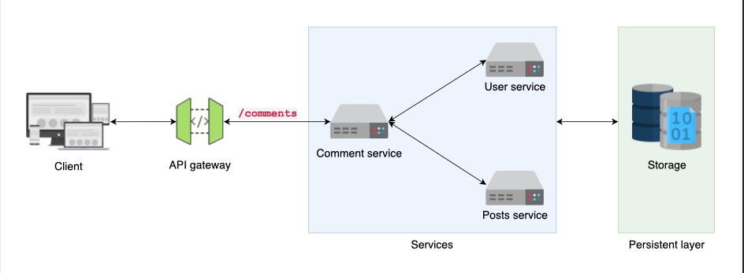
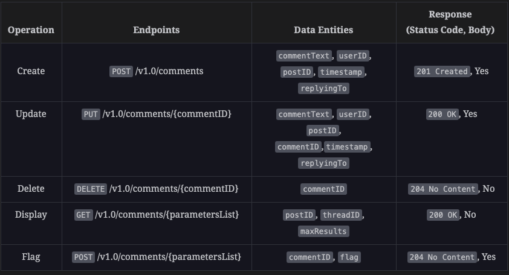

### Functional requirements:
1. Create a comment: The first operation that our proposed API should allow is to post a comment.
2. Update a comment: The API should allow users to update or edit their comments after posting them.
3. Get comment(s): The API should allow users to fetch comments from the back-end servers.
4. Delete a comment: Users should be able to delete or remove a comment they posted.
5. Flag comments: In case something violates the platform’s code of conduct, any user can flag a comment—be it the author of the resource where the comment was posted or a user reading the comment.

### Non-functional requirements:
1. Scalability: Our API should be able to handle an ever-increasing number of users commenting on different posts.
2. Availability: Our API should be highly available to provide continuous service to users.
3. Security: Our API should adopt the latest authorization and authentication mechanisms to provide secure services. Furthermore, it should also secure communication between clients and servers.
4. Reliability: Our API should be highly reliable and operate correctly despite failures in one or more parts of the system.
5. Low latency: Users should be able to see all publicly posted comments with low latency.

### Important components:
1. User service:
    1. Stores user-relevant data
    2. Makes use of a cache and a relational database
2. Comment service:
    1. Stores the comments in the relevant database
    2. Communicates with the other services
    3. Caches the top N (say, top 10) comments
3. Posts service:
    1. Handles the content and metadata related to posts 
    2. Cache stores frequently visited posts
    3. Blob storage keeps media files including images and videos



### Architecture styles:
1. Client to API gateway: Since we do CRUD operations, we will use REST style.
2. API gateway to other internal services: We use REST because our operation is limited to CRUD.
3. Between other services like comments service & post service: We use gRPC because its best suited for server-to-server communication.

### Data-formats:
JSON is the suitable choice for client and API gateway communication for better readability and debugging. It’s also a good choice for 
communication between the API gateway and back-end services because the comment service also uses REST architecture for downstream services.

### Base URL and API endpoints:
https://api.comments.com/v1.0/comments

#### Comment data entities:
```text
type comment 
{
    commentID: string            \\ The ID of the comment
    userID: string               \\ The ID of the user posting the comment
    postID: string               \\ A unique ID of the post for which the comment has been added
    commentText: text            \\ The text of the comment
    timestamp: date              \\ The date and time on which the comment has been added.
    commentLink: hyperlink       \\ The link of the comment
    threadID: string             \\ Specify a comment for which replies should be retrieved.
    replyingTo: string           \\ ID of the commenter to which the comment is posted             
    maxResults: unsigned integer \\ The maximum number of comments to be retrieved in a request
    pageToken: string            \\ An ID to identify a specific page
    pageInfo:  object            \\ JSON object containing the page information
    commentItems: list           \\ A list of comments that are retrieved
    flag: boolean                \\ Specify whether to mark a comment as spam or not
    flagCategory: text           \\ The reason to flag a comment.
}
```



### Few considerations:
1. We send the comment request from the client asynchronously so that the client is not stuck since the processing happens via queue.
2. We use rate-limiting.
3. To reduce latency, 
    1. We try caching the top-rated comments
    2. Bring the backend-servers geographically near to the client.
    3. Process the comments asynchronously.
