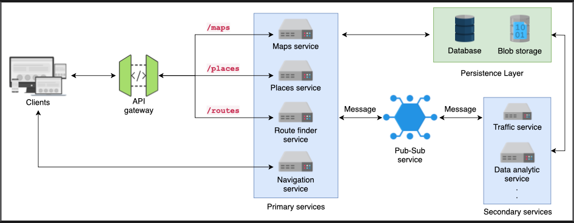
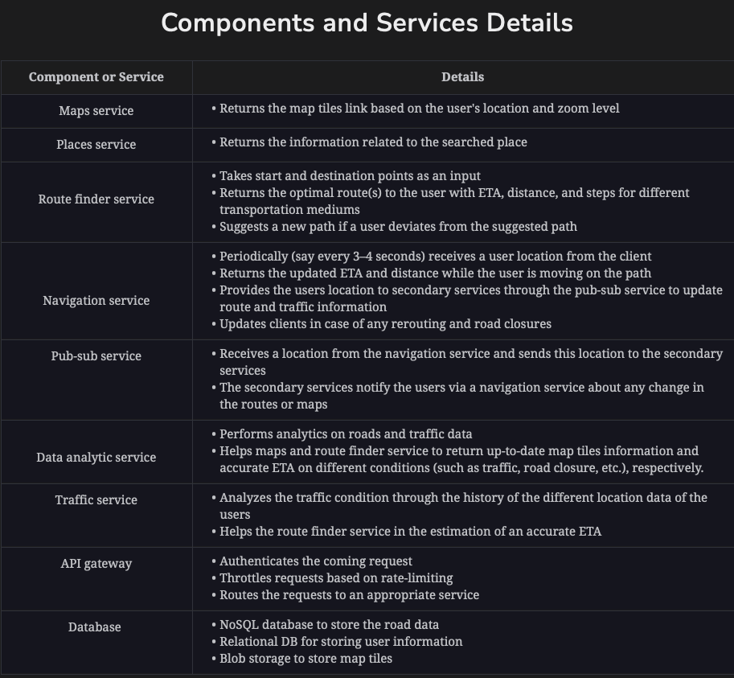
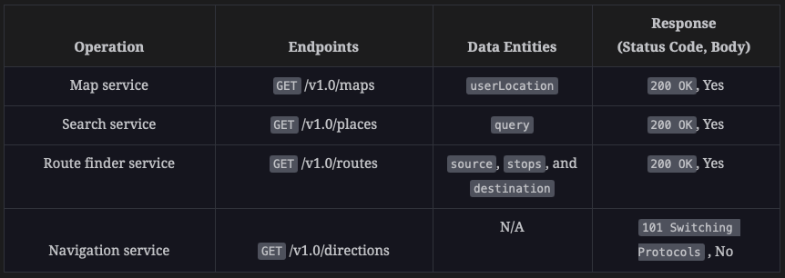

### Functional requirements:
1. Map: The API should be able to return a specific map area as a snapshot based on the user's location.
2. Route finder: The API should return the optimal path(s) with distance and the estimated time of arrival (ETA) based on the source, destination, and mode of transportation.
3. Navigation: When the user starts navigating toward the destination. The navigation service takes the user's location from the global positioning system (GPS) and helps users to make correct decisions along the route. At the same time, the navigation service updates the ETA and distance.
4. Search place: The API should find and return the information of the searched location/entity.

### Non-Functional requirements:
1. Availability: The API should have high availability, allowing users to perform desired operations.
2. Accuracy: The API should return the optimal route(s) with an accurate ETA.
3. Scalability: The API should be scalable to handle a large number of user requests.
4. Low latency: The API should return the response of all services in real time. Although different functional requirements may have different latency requirements, our service should be able to provide responses or updates as the service demands. For instance, a service like navigation will have stringent latency requirements.





### Architecture styles:
1. Client-to-API gateway: We use REST to get responses from search, places, and route finder services, mainly because they follow the request-response model.
2. API gateway-to-backend services: REST is a suitable option here, as a user does not request all services simultaneously, even if certain services communicate with each other to fulfill a user’s requirement.
3. Client-to-navigation service: To deliver live updates in real-time to the clients, we use event-driven architecture here. The real-time updates require a direct connection to minimize latency. Obviously, we will first need to establish an HTTP connection to upgrade to event-driven architecture.

### Communication protocol:
For connection between clients and the navigation service, we need a persistent connection to exchange data swiftly and deliver live updates in real-time. 
The WebSockets would be a better option.

### Data-Formats:
1. Binary format for Images and multimedia files.
2. Json for textual content.

### Base URL and API endpoints:
https://api.googlemaps.com/v1.0/{services}

### Google Maps data-entities:
```text
type maps 
{
    mapTiles: list         //This is the array of the image links and their associated IDs
    placeInformation: list //This is a list of the search location attributes
    source: string         //This is the address of the starting point
    destination: string    //This is the address of the ending point
    stops: list            //This list contains the information of the stops 
    userLocation: string   //This is the address of the user's current location
    distance: string       //The distance between the origin and destination
    duration: string       //The total time required to reach the destination
    steps: list            //This is the list of the steps required to reach the destination 
    polyline: string       //This represent the route information in the form of a line on the map
    transportMode: string  //This defines the transportation mode such as car, bus, bike, etc.
}
```

### Navigation Service Connection:

Request: We use Websocket to establish the connection. The connection starts as an HTTP connection and then upgrades to Websocket.
```http request
GET /v1.0/directions/ HTTP/2
Connection: Upgrade
Host: api.googlemaps.com
Upgrade: websocket
Sec-WebSocket-Key: sdnjmkowdd_eBsFeei7
Authentication: token
//essential headers
```

Response:
```http request
HTTP/2 101 Switching Protocols
Connection: Upgrade
Sec-WebSocket-Accept: zglqWZt8l_7ZShrBAFTDKUgKihrE8Iob
Upgrade: websocket
//essential headers
```

After making the connection, the client sends its location to the navigation service this way:
```json
{   
    "connection_id": "zglqWZt8l_7ZShrBAFTDKUgKihrE8Iob",
    "source": { "latitude": 34.014061, "longitude": 20.87840 }
}
```

Considering the destination, the navigation service sends the remaining distance and remaining ETA:
```json
{
    "connection_id": "zglqWZt8l_7ZShrBAFTDKUgKihrE8Iob",
    "transportMode": "Car",
    "duration": "19 min",
    "distance": "14.1 miles"
}
```



### Achieving low-latency:
1. Regionally distributed Google Maps server
2. Caching frequently searched routes
3. WebSocket connection between client and navigation service
4. Prefetching neighboring map tiles