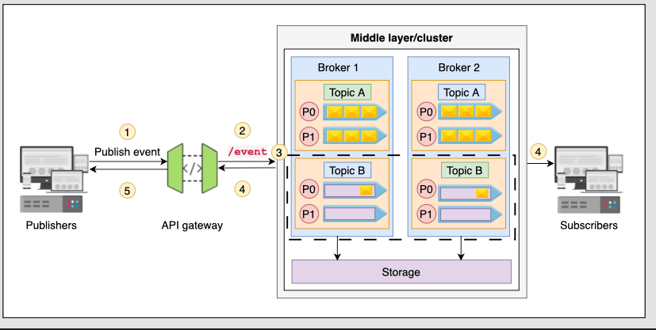
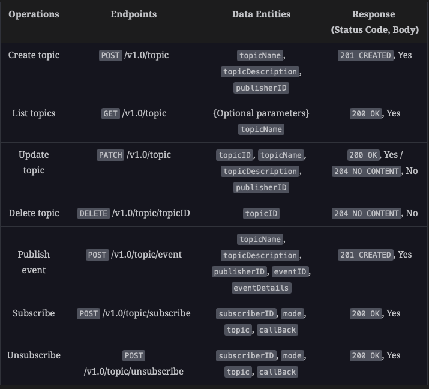

### Functional requirements:
1. Create topic/publish event: The pub-sub service should enable a user (publisher) to create a topic or publish an event related to any topic.
2. List topics: The service should allow users to request a list of available topics.
3. Subscribe: The service should allow users to subscribe to a specific topic.
4. Unsubscribe: The service should allow users to unsubscribe from a specific topic after they've subscribed to it.

### Non functional requirements:
1. Availability: Ideally, our API should be highly available because all publishers and subscribers depend on the availability of the service to work properly. Moreover, because this service is used as a building block in many design problems, the consequences can be catastrophic if it fails.
2. Scalability: Our API should smoothly handle a large number of requests from publishers. It should be able to handle many topics, many publishers per topic, and many consumers per topic.
3. Security: The pub-sub API and publisher-subscriber communication must be secure.
4. Low latency: The API needs to be highly performant to handle concurrent operations.

### Important components:
1. Pub-sub service
    1. A middle layer that decouples clients and services
    2. Communicates between publishers and subscribers
    3. Contains all the created topics and events
    4. Publishes the topics or events to services that have subscribed to the event
2. Publishers
    1. Publishes topics and events related to those topics
3. Subscribers
    1. Subscriber of the event that receives notifications. They can be users or other services
4. API gateway
    1. Authenticates and authorizes user requests
    2. Rate limits the incoming requests
    3. Analyzes and routes requests to appropriate services



How does the server send the notifications to the subscribers? <br/>
By passing a callback url, which is used to send the notifications to the client.

### Architecture Styles:
#### Client to API gateway to Pub-Sub service:
We can use the request-response model to get a list, subscribe to topics, and unsubscribe to topics in the pub-sub API. 
This is because the nature of these operations is resource oriented and requires a few endpoints to be accessed. 
REST is the best option because it provides a simple and standardized way to manage resources via CRUD operations. <br/>

#### Pub-sub service to subscribers:
The next interaction is between the pub-sub service and the subscribers of an event, and it’s purely based on event occurrence. 
Therefore, the most suitable option is to use EDA (event-driven such as WebSub, WebHooks, and WebSockets) to communicate between the pub-sub service and the subscribers. <br/>

#### Data formats:
Json is the best choice because the events can be readable and debugged.

#### Communication protocols:
Event-driven protocols send events to subscribers. We can employ event-driven protocols like WebSub, WebHooks, and WebSockets.

#### WebSub Protocol:
WebSub is a protocol that enables a subscriber to receive notifications about updates to a resource (topic) from a publisher via a broker. 
The broker acts as an intermediary that manages subscriptions and distributes notifications to subscribers. <br/>
When the publisher updates the topic, it sends a notification to the hub. The hub then sends a notification to all subscribers' callback URLs with the updated content. <br/>
WebSockets and Webhooks: WebSub can use WebSockets or webhooks for delivering notifications. WebSockets are useful for real-time, bidirectional communication, while webhooks are simpler and rely on HTTP callbacks. <br/>

### Base URL and API endpoints:
https://api.pubsub.com/v1.0/{service}

#### PubSub data-entities:
```text
type pubsub 
{
   subscriberID: string     // Unique identifier for each subscriber
   publisherID: string      // Unique identifier for each publisher
   topic: string            // URL or address of the topic to subscribe or unsubscribe
   topicID: string          // Unique identifier for the created topic in pub-sub
   topicName: string        // Name of the topic created by a publisher
   topicDescription: string // The description of the topic
   canPublish: boolean      // A parameter defining whether a publisher can publish events or not
   canSubscribe: boolean    // A parameter defining if topic is allowed to be subscribed
   pageNumber: integer      // Indicating page numbers of listed data
   limit: integer           // The maximum number of results per page           
   eventID: string          // A unique identifier of an event
   eventDetails: string     // Details or description of the event
   mode: string             // defining mode of the request "subscribe"/"unsubscribe"
   callBack: string         // URL of the subscriber where pub-sub pushes notifications
   authToken: string        // A unique token to authenticate user
   timeStamp: DateTime      // Time for subscription for limited time subscriptions
   timeOut: DateTime        // Time indicating the failure of the request
}
```




