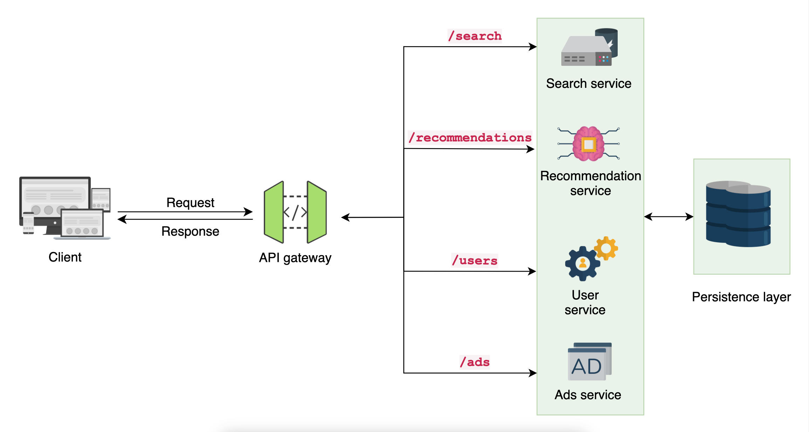
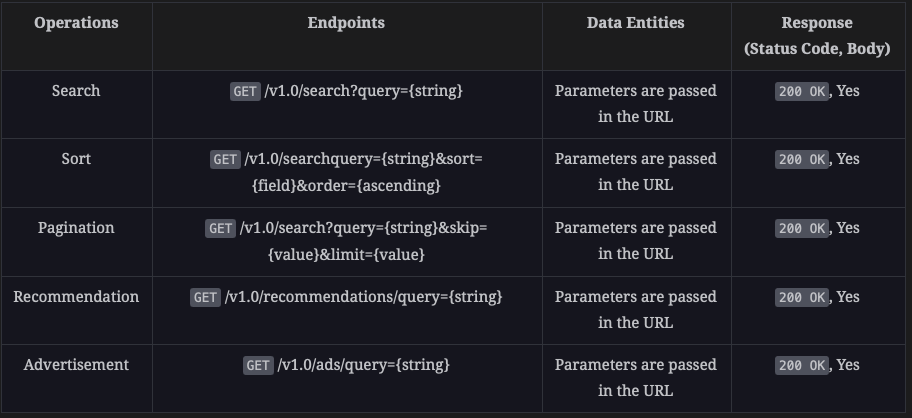

### Design a Search Service:
#### Functional requirements:
1. Searching
2. Sorting: 
    1. example query: /search?query=transactions&sort=date&order=descending
    2. example query with multiple field: /search?query=transactions&sort=date:descending,name:ascending
3. Pagination

#### Non-functional requirements:
1. Availability
2. Scalability
3. Security
4. Low latency

#### Components in the Search Service:
1. Search Service: This is the app which receives the request.
2. Searcher: 
    1. Parses the search string.
    2. Searches for the mappings in the index table.
    3. Returns the most matched results.
3. Indexer:
    1. Categorizes data after getting it from the application's database.
    2. Performs indexing of data and stores it in the index table.

   

#### Types of pagination:
1. Skip and Limit: The client asks the server to skip some data and return only limited data, this leads the server to always skip x amount of data before returning. Ex: /search?query=courses&skip=10&limit=20
    1. Efficient for small datasets
    2. Allows the user to navigate to any page. 
2. Cursor-pagination: Instead of skipping rows at every request, it passes a cursor to the client which is sent in the next request. This cursor is a pointer which makes search faster. Ex: /search?query=course&limit=15&next-cursor=15
    1. It allows for scrolling instead of jumping to any page. 
    2. Efficient for large datasets. 
3. Bucket-pattern: The bucket pattern divides search results into groups of fixed size. These groups are also called buckets. However, each bucket is skipped using a pattern similar to skip and limit pagination. The difference here is that it improves efficiency by skipping buckets instead of skipping records one by one.
    1. Efficient for large datasets
    2. Allows the user to navigate to any page

A typical search query will simultaneously reach all the services that will produce query-specific responses. <br/>
#### Architecture style:
1. Client to API gateway: User only sends a query instead of creating or updating any resources on the backend; therefore, it can be easily performed via the GET HTTP method.
2. API gateway to back-end services: The operations performed are mainly resource oriented, and the API gateway possibly has to fetch data from multiple services. 
   gRPC is excluded because it’s action oriented and is better for intra-service communication, such as performing function calls very quickly and efficiently. 
   Now, we’re left with the REST and GraphQL options to decide on. The REST architecture is suitable because the search service returns complete documents rather than custom fields and sections from different documents.
   GraphQL brings maintenance overhead and tightly couples the backend to the API gateway because the client must know the schema before retrieving data, and the clients must also update their implementation accordingly if we change the internal schema.
3. Data Format: We employ JSON data formats for the communication between the interacting entities: client, API gateway, and back-end services. 

### Base URL and API endpoints:
#### https://api.search.com/v1.0/services
1. We need to the base url which is api.search.
2. Version: v1.0
3. services part can be replaced with the service name such as: ads, search, recommendation, etc.

#### Search Query string request format:
```http request
GET /v1.0/search/query={string} HTTP/1.1
HOST: api.search.com 
Accept: application/json
X-API-KEY: "API Key"
//other headers
```

#### Search Query string response format:
```text
HTTP/1.1 200 OK
Content-Type: application/json
//other headers
{
   "query":  "Java Courses",
   "pageNumber": 1, 
   "count": 10,
   "results": [...]
}   
```

#### Request Query for ads service:
```http request
GET /v1.0/ads/query={string} HTTP/1.1
HOST: api.search.com 
Accept: application/json
X-API-KEY: "API Key"
//other headers
```
#### Response Query for ads service:
```text
HTTP/1.1 200 OK
Content-Type: application/json
//other headers
{
    "adsSuggestions": {
         { "id": 1, "title": "value", "image" : "link" ....},
         { "id": 2, "title": "value", "image" : "link" ...},
}   
```



### Adding Filtering to the API:
1. Simple Filter: In simple filtering, the search query filters results on the basis of a single entity. For example: search?query=Java&filter=Yes&Level=Intermediate, here we filter the query=Java by Level=Intermediate.
2. Complex Filter: The search query filters results on the basis of a defined range. Example: search?query=Java&filter=Yes&price=gte:$29&price=lte:$32

### Versioning the API:
1. Minor version: From v1.0 to v1.1, we make a minor version update when the API adds features which are optional such as new filteirng capabilities.
2. Major version: From v1.2 to 2.0, we do this when the API changes may break the client code.

### Achieving Non-functional requirements:
1. Availability:
    1. Implement rate limiting to avoid overloading the API
    2. Use API monitoring tools to detect the spike or any unusual actions
2. Scalability:
    1. Replicate all the services involved in the search API
    2. Use caching solution
3. Security: 
    1. Use API keys to authenticate the client
    2. Use user credentials for authentication to provide the personalized response
4. Low-Latency:
    1. Use high-speed cache in the API gateway
    2. Use pagination to avoid the unnecessary payload
    3. Set timeout for the queries
