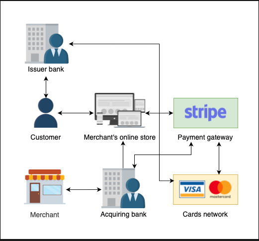
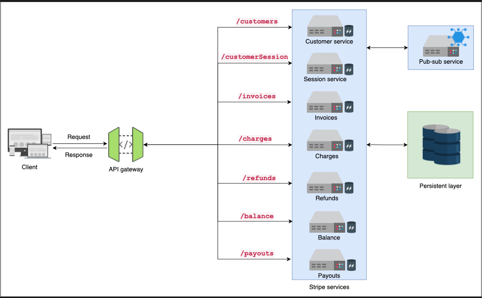
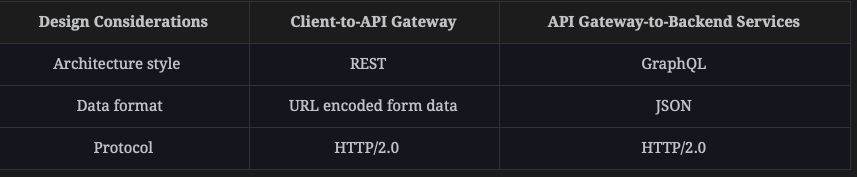
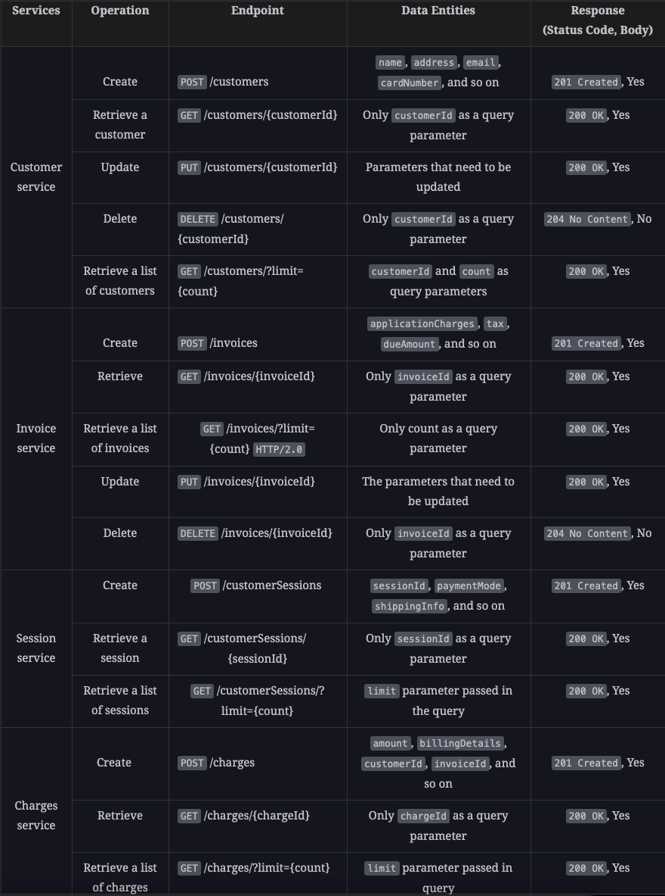
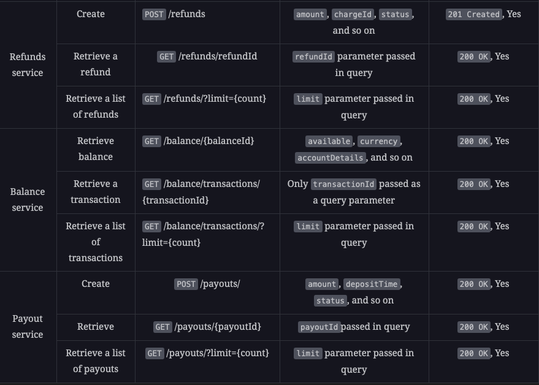
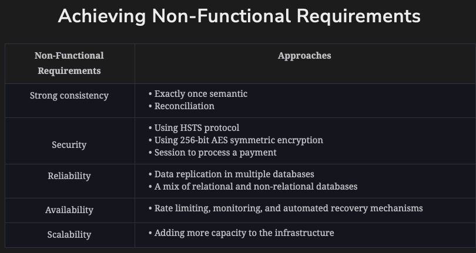

### Functional requirements
1. Payment: The Stripe API should allow merchants to charge their customers for products the customer intends to purchase.
2. Customers' data: Stripe API should provide operations relevant to a customer, such as creating, updating, deleting, and storing a customer's information (credit/debit cards, personal details, etc.) securely.
3. Invoices: The API should provide an invoice to customers before charging them for a purchase.
4. Transaction details: Stripe API should provide all transaction details performed in a merchant's account, including purchases, refunds, payouts, and so on. It should also allow one-time and recurring payments.
5. Balance: Stripe API should enable merchants to view the status of the account, such as current balance, statement, and so on.

### Non-functional requirements
1. Strong consistency: The API should be strongly consistent and should update all the sources of truth (databases) even if it costs performance. For example, a transaction should trigger updates in the customer's and the merchant's account. It shouldn’t be the case that an amount is deducted from one account but not received in another.
2. Security: The API should incorporate state-of-the-art security mechanisms to protect customers' and merchants' data and their valued money in addition to authentication and authorization mechanisms. Our API should ensure the security of transactions, accounts, and debit and credit card details.
3. Reliability: The API should also be highly reliable and should continue to perform services despite errors in one or more components.
4. Availability: The API should be highly available to provide uninterrupted services to customers and merchants.
5. Scalability: The API should support any number of customers, merchants, and associated transactions.

### Entities details:
1. Customer: A cardholder who wants to purchase goods or service
2. Merchant: A company or person who provides goods or services
3. Issuer bank: The bank that holds the customer’s account and provides credit or debit cards
4. Acquiring bank : The bank holding the merchant's account
5. Merchant's online store: The online website where the customer purchases goods or services by providing credit card details
6. Stripe:
    1. A network that facilitates and authorizes transactions of funds to merchants’ account
    2. Requests and receives payment from the customer’s account
7. Cards network:
    1. Validates the credit or debit card information 
    2. Facilitates payments via credit and debit cards
    3. Sets the terms for credit or debit card transactions

### Flow of payment:
The flow of payment processing takes place in the following steps:
1. The authorization phase
2. The settlement phase

#### Authorization phase:
1. The customers select the goods or services they want to purchase online, go to the checkout page, and enter their credit card information. Here, a transaction is created, including information about the customer, their credit card, the goods or services purchased, and so on.
2. The transaction information is provided to Stripe for further processing. Stripe stores the transaction details to facilitate funds transfer in the later phase.
3. Stripe routes the credit/debit card details and transaction information to the cards network.
4. The cards network performs the credit card’s authentication and passes the transaction information to the issuer bank to check the validity of the customer’s account information.
5. The issuer bank checks the status of the customer’s account and the availability of funds. Upon confirmation of their availability, it places a hold on the required funds.
6. The issuer bank responds with a successful authorization code to the cards network, which is passed to Stripe.
7. Stripe sends the authorization code to the acquiring bank.
8. The acquiring bank provides the approval to the merchant’s terminal, which in turn may provide the receipt to the customer.
9. Meanwhile, Stripe updates the transaction information in its database based on the authorization codes provided by the issuer bank via cards network.

#### Settlement phase:
1. At the end of the day, Stripe collects all the transactions and corresponding authorization codes from the database and transfers them to the acquiring bank. The purpose is to withdraw the respective amount from the issuer’s bank.
2. The acquiring bank sends all data to the cards network to validate each transaction and its corresponding authorization codes. 
3. The cards network routes all transaction information to the issuer bank for verification.
4. The issuer bank transfers the funds to the merchant account in Stripe after successful verification. The verification is performed against each authorization code provided in the authorization phase.
5. The issuer bank provides a bill to the customer or the cardholder for every successful transaction.
6. The merchant can later transfer the funds from the Stripe account to their bank account in the acquiring bank.

Q. Why does the issuer send funds to Stripe and not to the acquiring bank?  
Issuers send funds to Stripe because Stripe acts as a payment processor. It securely transfers funds from the issuer to the merchant’s account. 
This helps to ensure that the funds are transferred securely and that the merchant receives the correct amount.  

### API architecture styles:
1. Client-to-API gateway: The interaction with the API gateway occurs in a request-response paradigm to access multiple resources and perform CRUD operations on them. As a result, we opt for the REST API architecture style.
2. API gateway-to-backend services: A single request might need data from multiple endpoints because we are targeting multiple interdependent services via the API gateway. we need a data federation strategy to unify data from multiple sources, which can be easily achieved by incorporating GraphQL between the API gateway and backend servers.

### Data Formats:
##### Request Data:
Stripe works with critical data; therefore, we need to allow restricted access to it. For this reason, the server accepts data in the x-www-form-urlencoded format.
The application/x-www-form-urlencoded content type is commonly used for submitting data through HTML forms on the web. 
It encodes key-value pairs as a string in the format key1=value1&key2=value2  

##### Response Data: 
JSON fits well into the GraphQL paradigm as the data format of choice. It is a suitable option for API and backend services. 
Another reason for choosing JSON is that the Stripe backend services frequently talk to third-party services, so using a compact and human-readable format makes sense.  

### Base URL and endpoints:
https://api.stripe.com/v1.0/{service}

