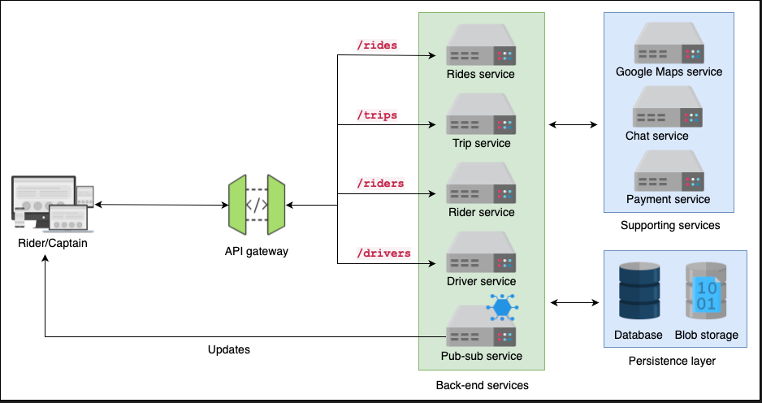
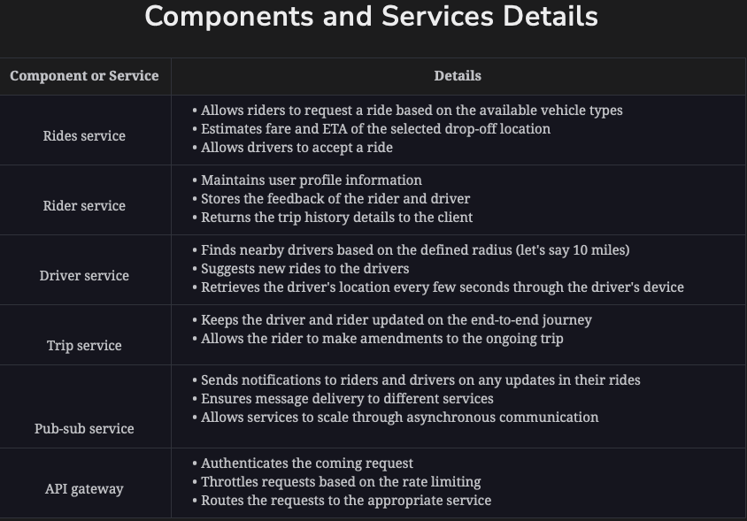
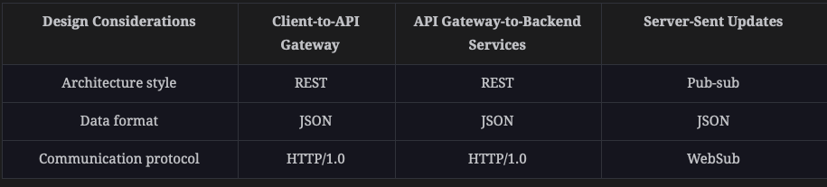
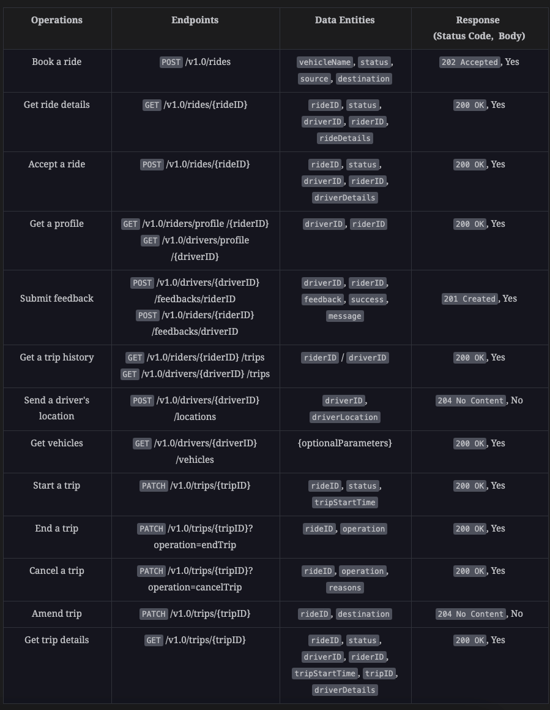
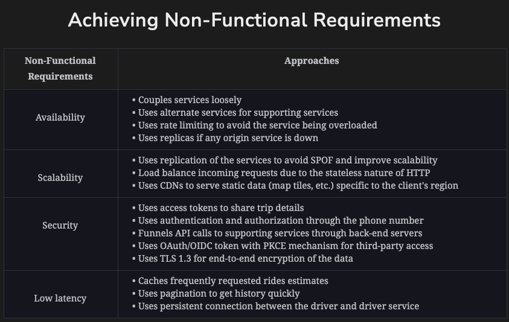

### Functional requirements:
1. Book a ride: A rider can request a ride, the estimated time of arrival (ETA), and get an estimate of the fare of the ride using our API. Also, the driver should be able to accept or reject that request while using our services.
2. Trip processes: The driver should be able to start and end the ride. Additionally, riders should be able to make modifications, such as adding or removing stops during a trip.
3. Rider/driver activities: Riders and drivers should be able to see previous ride histories and current trip details. Additionally, the API should be able to store feedback from drivers and riders. Also, our API should allow users (passengers and drivers) to view and update their profiles.
4. Chat: Our API should allow riders and drivers participating in a ride to exchange messages between them.
5. Payment: Our API should allow riders to pay fares for rides using different payment methods.

### Non-functional requirements
1. Availability: The API should allow riders and drivers to use different services at all times. Therefore, the API should be highly available to them.
2. Scalability: The API should handle an ever-increasing number of requests.
3. Security: The user's payment, profile, ride history, and any other information in the API should be secure.
4. Low latency: The API should provide a swift response to the users.





### Architectural styles:
1. Client-to-API gateway: The Uber API mainly performs CRUD operations over resources, such as user, trip, and ride data. We opt for the REST API architecture style.
2. API gateway-to-back-end services: REST is easily scalable, we can ensure scalability and asynchronous communication with the help of pub-sub. One main reason for selecting REST is that the APIs of our supporting services (Maps, etc.) are also RESTful, and our backend will need to call these APIs as per the REST architecture.
3. Server-sent updates: The Uber services involve a bunch of live updates. Therefore, the role of pub-sub is not only attending to matters of scalability and asynchronous communication but also updating users (riders, drivers). Riders are updated on the completion of a trip, while drivers get notifications about the availability of a ride. We can’t use the request-response paradigms here because these updates are pushed from the server side to the client. Therefore, we use event-driven architecture to send the updates to the client. The pub-sub service uses the WebSub protocol to send updates from the server to the riders and drivers.

### Data Formats:
1. Client-to-API gateway: The communication between the client and API gateway follows the REST architectural style, and it’s recommended that we should use JSON with the REST.
2. Server-sent updates: The data formats between the server and the client also use JSON data format because it’s easily understandable by the developers and helps them interpret the response.



### Base URL and API endpoints:
https://api.uber.com/v1.0/{service}

### Data-Entities:
```text
type Uber {

    riderID: string           // A unique ID that represents a rider ID of the Uber user
    riderName: string         // Name of the rider
    driverName: string        // Name of the driver
    email: string             // Email of the user (rider/driver)
    timestamp: date           // The time user's account is created
    contact: string           // Phone/mobile number of the rider or driver
    vehicleID: string         // A unique ID for the vehicle 
    profilePicture: string    // This is a profile image of the user
    vehicleImage: string      // This is a image of the vehicle 
    driverID: string          // A unique ID that represents a driver in the Uber system
    driverMode: boolean       // Indicates whether the driver is active or not
    driverLocation: string    // This is the address of the driver's current location
    feedback: string          // This is the feedback from the rider/driver 
    offset: integer           // Offset from where the results (e.g. ride history, user
                              // feedback) should begin to be returned
    limit: integer            // The maximum number of results to return
    trips: list               // List of previous trips history
    tripCount: integer        // Total number of trips that the user has made
    tripStatus: string        // Trip status such as "In Progress", "Completed"
    tripStartTime: DateTime   // This represents the start time of the trip
    tripEndTime: DateTime     // This represents the end time of the trip
    source: list              // Address of the pickup location
    destination: list         // Address of the drop-off location
    duration: DateTime        // The total time spent on the trip
    distance: double          // The total distance covered during the trip
    fare: double              // Fare of the trip
    vehicles: list            // List of available vehicles 
    vehicleName: string       // Name of the vehicle
    tripID: string            // A unique ID that represents a trip 
    rideRequestTime: string   // This represents the request time of the ride
    seats: integer            // This represents the number of seats in the vehicle
    driverDetails: list       // List of the driver and their vehicle details
}
```



#### One good way to load balance client request:
Shared sessions: In the shared session approach, the session is stored in some common storage (memory, cache, etc.) to allow the server to seamlessly 
handle requests from different clients with different session IDs. <br/>

