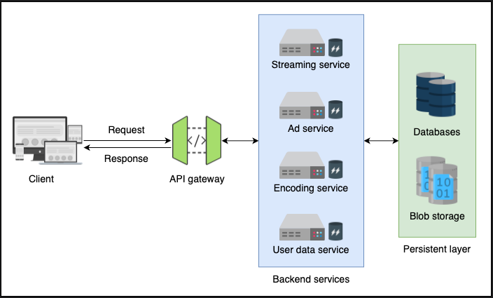
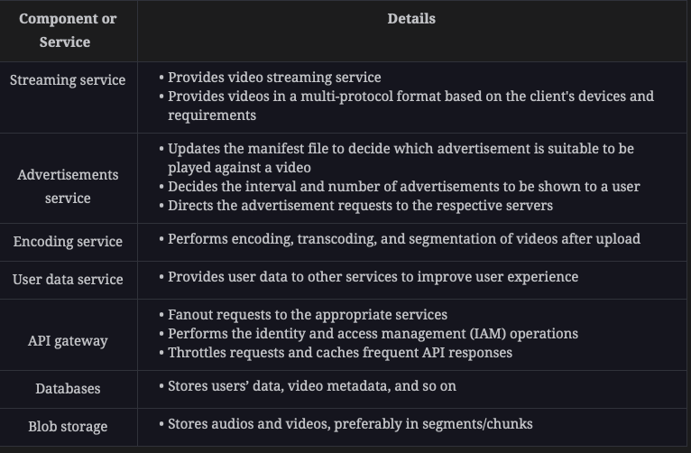
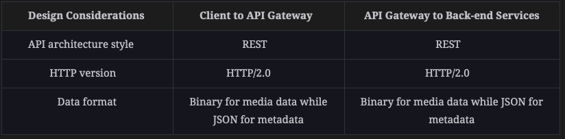
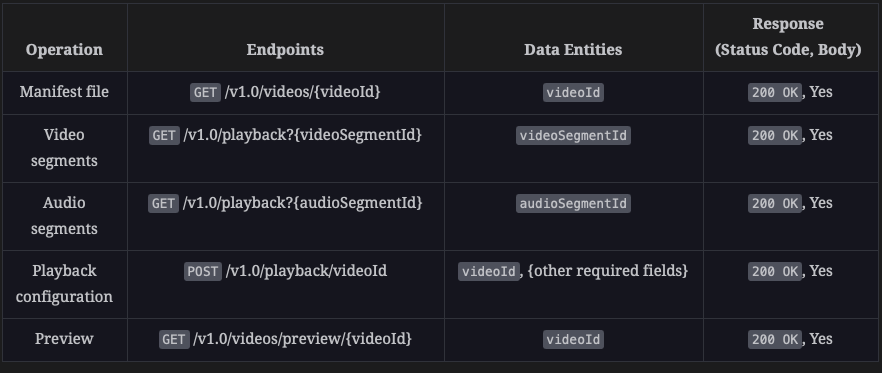

### Functional requirements
1. Video searching: Users should be able to search for a video through the vast repository of YouTube videos.
2. Video streaming: Users should be able to stream a video uninterruptedly.
3. Video preview: This service should allow users to obtain video trailers.
4. Rating a video: Each video needs to have a like or dislike button.
5. Video uploading: Users should be able to upload videos.
6. Comment on a video: Users should be able to add multiple comments on a video.

### Non-functional requirements:
1. Scalability: The system should be scalable to handle the ever-increasing number of users.
2. Availability: The system should be highly available to provide uninterrupted services.
3. Flexibility/adaptability: Since YouTube is a popular service, a number of devices are used to access it. This requires the API to be flexible and consistent across various devices like TVs, mobile phones, desktop computers, laptops, and so on.
4. Security: The API should allow only privileged users to manipulate their content. Furthermore, users should be able to communicate securely with the API.
5. Low latency: The system should be adaptable to changing network conditions, such as low bandwidth and occasional network congestion.





### Architectural Styles:
1. Client to API Gateway: Since retrieving a video is a subset of the CRUD operations, this naturally fits the REST API architecture style.
2. API gateway to back-end servers: Keeping the CRUD operations on videos and filtering attributes in view, we employ the REST architecture style.


### Connection Protocol:
YouTube uses the QUIC protocol. QUIC (Quick UDP Internet Connections) is a transport layer network protocol developed by Google, 
designed to improve the performance of connection-oriented web applications, such as video streaming. <br/>



### Base URL and API Endpoints:
https://api.youtube.com/v1.0/{service}

#### Common Data-entities:
```text
type video 
{
 id: string            \\ This is the ID of the video.
 publisherId: string   \\ This is the ID of the user who published the video.
 channelId: string     \\ This is the unique ID of the channel that the video is associated to.
 title: string         \\ This is the title of the video.
 url: hyperLink        \\ This is the link of the video.
 playlistId: list      \\ Specify the playlist(s) the video is associated with.
 thumbnails: list      \\ List containing links to preview images of different chapters of video.            
 next: hyperLink       \\ Link to next recommended video.
 category: string      \\ Text describing niche/category of video.
 description: string   \\ Text containing additional information about the video.
 uploadTimeStamp: date \\ The date and time at which the particular video is uploaded.
 preview: hyperLink    \\ This is the url of image/gif file to preview the video on hover.
 fileSize: long        \\ Total size of a video file in bytes.
 segments: list        \\ A list of urls of video/audio chunks of the video being streamed.
 tags: list            \\ A list of keywords that help in better search for the video.
 permissions: list     \\ This list describes the access privileges for this video.
 qualities: list       \\ This is a list of available resolutions for a specific video.
 ads: list             \\ A list of ad links to embed when the video is played.
 statistics: list      \\ A list of values (likeCount,dislikeCount,viewCount,etc.) of this video.
}
```
#### Manifest file: 
The client requests a manifest file that contains information about all the segments of the requested video, the client requests each segment individually.

