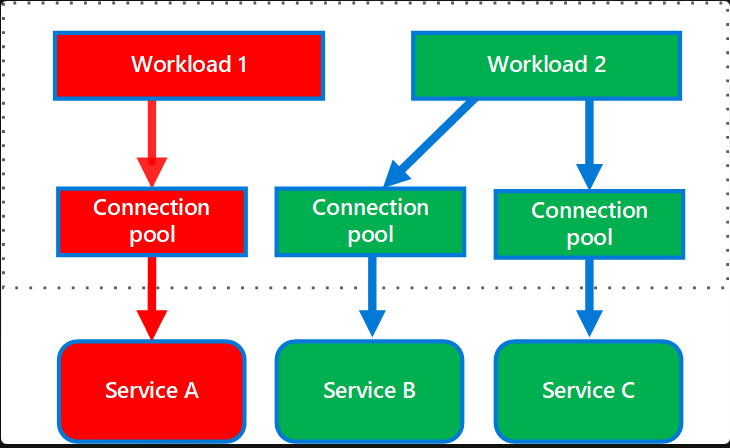
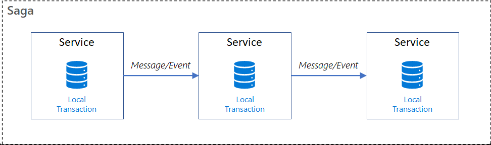

# Strangler Fig Pattern:
### Definition:
The Strangler Fig Pattern is a software design pattern used to incrementally migrate a legacy system to a new architecture by gradually replacing specific pieces of functionality with new applications and services. 
This pattern is particularly useful for modernizing large monolithic applications without causing significant downtime or disruption.  

### Steps Involved
1. Identify Components: Analyze the monolithic application to identify components that can be incrementally replaced.
2. Create Microservices: Develop new microservices to replace the identified components.
3. Implement a Façade: Use a façade to intercept requests to the legacy system and route them to either the old or new components.
4. Incremental Replacement: Gradually replace the old components with new microservices, ensuring that the system continues to function seamlessly.
5. Decommission Legacy Components: Once all components are replaced, decommission the legacy system.

### Benefits
1. Reduced Risk: Incremental changes minimize the risk of system failure.
2. Continuous Delivery: New features can be delivered continuously without waiting for a complete rewrite.
3. Improved Scalability: Microservices can be scaled independently.

### Challenges
1. Complexity: Managing two systems (legacy and new) simultaneously can be complex.
2. Façade Management: The façade must be carefully managed to avoid becoming a bottleneck or single point of failure.

# API Gateway Pattern:
### Definition:
The API Gateway pattern is a design pattern used in microservices architecture to provide a single entry point for clients to interact with multiple microservices. 
It acts as an intermediary that handles requests from clients, routes them to the appropriate microservices, and aggregates responses if necessary. 
This pattern helps to decouple clients from the microservices, providing a more manageable and secure way to handle communication.  

### Key Features of API Gateway
1. Reverse Proxy or Gateway Routing: The API Gateway acts as a reverse proxy, routing client requests to the appropriate microservices based on the request path, headers, or other criteria. This helps to decouple the client from the microservices and provides a single endpoint for the client to interact with.
2. Request Aggregation: The API Gateway can aggregate multiple client requests into a single request to reduce the number of round-trips between the client and the backend services. This is particularly useful for mobile or remote clients where latency is a concern.
3. Authentication and Authorization: The API Gateway can enforce security measures such as authentication and authorization, ensuring that only authenticated and authorized clients can access the microservices.
4. Load Balancing: The API Gateway can distribute incoming traffic across multiple instances of a microservice to ensure high availability and reliability.
5. Request Transformation: The API Gateway can modify request and response payloads to ensure compatibility between clients and services, making it easier to adapt to different client needs.
6. Caching: The API Gateway can cache responses to reduce the load on backend services and improve response times.
7. Logging and Monitoring: The API Gateway can centralize logging and monitoring, making it easier to track requests, errors, and performance metrics across all microservices.

### Benefits
1. Simplified Client Communication: Clients interact with a single endpoint rather than multiple microservices, simplifying the communication process.
2. Improved Security: Centralized authentication and authorization mechanisms enhance security.
3. Reduced Latency: Request aggregation reduces the number of round-trips between clients and backend services.
4. Scalability: Load balancing ensures that the system can handle increased traffic.

### Challenges
1. Single Point of Failure: The API Gateway can become a single point of failure if not properly managed.
2. Complexity: Implementing and maintaining an API Gateway can add complexity to the system.
3. Performance Bottleneck: The API Gateway can become a performance bottleneck if it is not properly scaled.

# Backend For Frontend (BFF):
### Definition:
The Backend For Frontend (BFF) pattern is an architectural approach in web application development that involves creating separate backend services tailored 
to the needs of different frontend clients. This pattern is particularly useful in scenarios where multiple user interfaces (UIs) such as mobile apps, web apps, 
and desktop applications require different data formats and interactions.  

The BFF pattern involves creating a unique backend for each user-facing frontend. These backends act as intermediaries, fetching data from various services 
and shaping it to fit the exact needs of the frontend. This approach ensures that each frontend receives precisely the data it needs, optimizing performance 
and user experience.  

### Key Concepts
1. Separation of Concerns: Each BFF is responsible for a specific frontend, allowing frontend and backend teams to work independently.
2. Tailored Data: The BFF fetches data from generic APIs and customizes it for the specific frontend, reducing unnecessary data transfer.
3. Improved Performance: By minimizing the logic on the frontend and handling data formatting in the BFF, the overall performance is enhanced.

### Benefits of the BFF Pattern
1. Optimized Data Transfer: Each frontend gets only the data it needs, reducing bandwidth usage and improving load times.
2. Simplified Frontend Logic: The frontend can focus on rendering data without worrying about data manipulation.
3. Scalability: Different BFFs can be scaled independently based on the load and requirements of their respective frontends.
4. Maintainability: Changes in one frontend do not affect others, making the system easier to maintain and evolve.

# Service Discovery Pattern:
The Service Discovery pattern is a crucial design pattern in microservices architecture, enabling services to locate each other dynamically within a network. 
This pattern addresses the challenge of finding the network locations of services, which can change frequently due to scaling, failures, or updates. 
Here’s an in-depth explanation of the Service Discovery pattern, including its types and examples.  

### Service Discovery involves three main components:
1. Service Registry: A centralized server that maintains a global view of all microservices' network locations (IP addresses and ports).
2. Service Providers: Microservices that register their network locations with the service registry.
3. Service Consumers: Clients or other microservices that query the service registry to find the network locations of service providers.

### How Service Discovery Works
1. Registration: Service providers register their network locations with the service registry at regular intervals.
2. Lookup: Service consumers query the service registry to find the network locations of the required services.
3. Invocation: Service consumers use the retrieved network locations to directly call the service providers.

### Types of Service Discovery Patterns
There are two primary types of service discovery patterns: Client-Side Discovery and Server-Side Discovery.

#### Client-Side Discovery Pattern
In the Client-Side Discovery pattern, the client is responsible for discovering the network locations of service instances and balancing the load among them.
##### How It Works
1. The client queries the service registry to get the list of available service instances.
2. The client selects an appropriate service instance using a load balancing algorithm.
3. The client makes a request to the selected service instance.

##### Advantages
1. Enables the client to make intelligent decisions based on specific requirements.
2. Facilitates application-specific load balancing decisions.
3. Simpler architecture without the need for an external load balancer.

##### Disadvantages
1. Tightly couples the client with the service registry.
2. Requires implementing service discovery logic for each programming language and framework used by the clients.
3. Increases complexity in managing disparate tools, technologies, and languages.

#### Server-Side Discovery Pattern
In the Server-Side Discovery pattern, the client does not interact directly with the service registry. Instead, a load balancer or router handles the discovery process.

##### How It Works
1. The client sends a request to a load balancer or router.
2. The load balancer queries the service registry to find an available service instance.
3. The load balancer routes the request to the selected service instance.

##### Advantages
1. Decouples the client from the service registry.
2. Simplifies client implementation as the discovery logic is handled by the load balancer.
3. Supports multiple programming languages and frameworks without additional discovery logic.

##### Disadvantages
1. Requires a highly available load balancer.
2. Adds an extra network hop, potentially increasing latency.
3. Requires managing and configuring the load balancer.

# Circuit Breaker Pattern
The Circuit Breaker pattern is a design pattern used in microservices architecture to prevent cascading failures and enhance system resilience. 
It acts as a safeguard, ensuring that a failure in one service does not lead to a total system breakdown.  

In a microservices architecture, services often need to communicate with each other. If one service fails or experiences high latency, 
it can cause the calling service to wait indefinitely, consuming precious resources such as threads. This can lead to resource exhaustion 
and potentially cause a cascading failure across the system.  

#### The Circuit Breaker pattern operates in three distinct states:
1. **Closed State**: In this state, the circuit breaker allows all requests to pass through to the service. It monitors the number of failures and, if the failures exceed a threshold, it transitions to the open state.
2. **Open State**: In the open state, the circuit breaker immediately fails all requests without attempting to call the service. This prevents the system from making calls to a service that is likely to fail, allowing the service time to recover.
3. **Half-Open State**: After a timeout period, the circuit breaker transitions to the half-open state. In this state, it allows a limited number of test requests to pass through. If these requests succeed, the circuit breaker transitions back to the closed state. If they fail, it returns to the open state.

The Circuit Breaker pattern is typically implemented at the code level. This pattern involves writing code that monitors the interactions between services, 
detects failures, and manages the state of the circuit breaker (Closed, Open, and Half-Open). Example: We can use a python decorator on an API to enable Circuit-breaker.  

### Benefits
1. Failure Isolation: Prevents a single service failure from cascading to other services.
2. Resource Protection: Protects system resources by failing fast and avoiding long waits for unresponsive services.
3. Resilience: Enhances the overall resilience and stability of the system.

### Challenges
1. Timeout Configuration: Choosing appropriate timeout values can be challenging. Incorrect values can lead to false positives or excessive latency.
2. Complexity: Implementing and managing circuit breakers adds complexity to the system.

### Real-World Implementations
1. Netflix Hystrix: A popular library that implements the Circuit Breaker pattern. It provides annotations and configuration options to easily integrate circuit breakers into microservices

# Bulkhead Pattern
The Bulkhead Pattern is a design principle used in software architecture to enhance system resilience and fault tolerance by isolating components or 
resources within a system. This pattern is named after the watertight compartments ("bulkheads") on ships, which prevent flooding in one area from 
affecting the entire vessel. In software systems, the Bulkhead Pattern involves partitioning components or resources into separate "bulkheads" to 
limit the impact of failures or overloads in one area on the rest of the system.  

### Key Concepts of the Bulkhead Pattern:
#### Isolation:
Isolation is the core concept of the Bulkhead Pattern. By isolating components, the pattern helps contain faults or failures within specific modules,
preventing them from spreading and affecting other parts of the system. This containment minimizes the impact of failures, reduces downtime, 
and maintains overall system stability. Docker-Compose is one of the ways to isolate the services and allocate them with required resources. 

#### Fault Tolerance
The Bulkhead Pattern improves fault tolerance by limiting the blast radius of failures. This means that even if one part of the system fails, 
the rest of the system can continue to function normally. This is achieved by partitioning system resources, such as threads or connections, 
into separate pools that can be allocated to specific components.  

#### Performance Optimization
By isolating resource-intensive tasks or services, the Bulkhead Pattern helps optimize system performance.

#### Security Enhancement
Isolation enhances security by reducing the attack surface and limiting the propagation of security vulnerabilities or breaches.

#### Scalability
Bulkheading supports system scalability by allowing compartments to be scaled independently based on workload demands or resource requirements.

### Web Application
Consider a web application that handles both user-facing HTTP requests and background processing tasks, such as sending emails or processing data. To implement bulkheading, separate thread pools can be used for handling these different types of tasks:
1. User-Facing Requests: A dedicated thread pool handles incoming HTTP requests from users, processing user interactions, generating responses, and returning results to clients.
2. Background Processing Tasks: Another dedicated thread pool handles background processing tasks asynchronously, such as sending emails or performing scheduled jobs.  
In this scenario, if a failure occurs in the background processing thread pool, it remains contained within that thread pool and does not affect the operation of the user-facing request thread pool.  

# Retry Pattern
The Retry pattern involves retrying an operation that has failed due to transient faults. Transient faults are temporary issues such as network glitches, service unavailability, or timeouts that are expected to resolve themselves quickly. By retrying the operation, the system can recover from these temporary issues without manual intervention.

### Importance of the Retry Pattern
1. Resilience: The Retry pattern enhances the resilience of applications by allowing them to recover from transient failures automatically.
2. User Experience: It improves user experience by reducing the number of visible errors and timeouts.
3. System Stability: It helps maintain system stability by preventing transient errors from causing cascading failures.

### When to Use the Retry Pattern
1. The failure is likely to be temporary.
2. The operation is idempotent, meaning it can be safely retried without causing unintended side effects.
3. The system can tolerate the delay introduced by retries.

### Retry Policies
1. Fixed Retry: Retries the operation a fixed number of times with a fixed delay.
2. Exponential Backoff: Increases the delay between retries exponentially.
3. Random Retry: Uses a random delay between retries to avoid synchronized retries across multiple clients.

# Sidecar Pattern
The Sidecar pattern involves deploying a secondary container (sidecar) alongside a primary application container. The sidecar container runs in the 
same execution environment as the primary application and provides supporting functionalities such as logging, monitoring, security, and service discovery. 
This pattern is named "sidecar" because it resembles a sidecar attached to a motorcycle, extending the capabilities of the primary application without 
altering its core logic.  

### Benefits:
1. Modularity and Encapsulation: By separating secondary functionalities into sidecar containers, each microservice can focus solely on its core business logic, promoting cleaner code organization and easier maintenance.
2. Scalability: Sidecar containers can be scaled independently of the primary application containers, allowing fine-grained control over resource allocation and better resource utilization.
3. Isolation: The sidecar container runs alongside the main service, ensuring isolation between the core service logic and auxiliary functionalities, minimizing the impact of failures in the sidecar.
4. Heterogeneous Components: The sidecar pattern allows applications to be composed of heterogeneous components and technologies, providing a homogeneous interface for platform services across languages.

### Challenges:
1. Increased Complexity: Implementing the Sidecar pattern adds an additional layer of complexity to the architecture, requiring proper management and coordination of multiple containers.
2. Potential Single Point of Failure: There is a risk of a single point of failure if the sidecar container experiences issues, necessitating resilience mechanisms like redundancy and health checks.
3. Increased Latency: The pattern introduces additional communication overhead between the main service and the sidecar container, which might not be preferred in latency-sensitive applications.

### Use Cases:
1. Logging and Monitoring: Sidecar containers can capture logs and metrics from the main service, aggregate them, and forward them to centralized systems, simplifying observability.
2. Service Discovery: Sidecars can act as service proxies, handling service discovery and load-balancing tasks, providing a unified entry point for communication.
3. Security: Sidecars can manage authentication, authorization, and encryption, offloading these tasks from the core service.
4. Content Transformation: Sidecars can handle tasks like encoding/decoding data or adapting APIs, ensuring the main service remains agnostic of these concerns.

#### Communication between main service and sidecars:
The primary method of communication between the main service and the sidecar is inter-container communication.  
1. Local Networking: Containers running on the same host can communicate over a local network.
2. Shared Volumes: Containers can share data by writing to and reading from shared volumes. 
3. Inter-Process Communication (IPC): IPC

# SAGA Pattern
The SAGA pattern is a design pattern used to manage distributed transactions in microservices architectures. It ensures data consistency 
across multiple services by breaking down a large transaction into a series of smaller, local transactions. Each local transaction updates 
the database and triggers the next transaction in the sequence. If any transaction fails, compensating transactions are executed to undo the 
changes made by the previous transactions.  

### Key Features of the SAGA Pattern
1. Coordinated Transactions: The SAGA pattern coordinates transactions across multiple services or processes. Each step in the saga is a local transaction executed by a single service, and the state changes are broadcasted to other services involved in the saga.
2. Compensation and Rollback: If a step in the saga fails, compensating transactions are executed to roll back the changes made by previous steps. This ensures that the system remains consistent even in the event of failures.
3. Distributed Transactions: The pattern supports distributed transactions that span multiple services, providing a way to coordinate these transactions in a consistent manner.
4. Asynchronous Processing: The SAGA pattern can support asynchronous processing, allowing for greater concurrency and performance, which is crucial in distributed systems.
5. Error Handling: It provides a standardized way to handle errors that occur during the transaction, ensuring consistent error handling across all services involved.
6. Scalability: The pattern can scale to handle large and complex transactions by breaking them down into smaller, more manageable steps that can be executed in parallel across different services.

### There are two main approaches to implementing the SAGA pattern: 
1. Choreography
2. Orchestration

### Choreography
In the choreography approach, each microservice involved in the saga publishes events that are processed by the next microservice in the sequence. There is no central coordinator; instead, each service knows the next step in the process and triggers it upon completion of its own task.  
Example: In an e-commerce application, the order processing might involve the following steps:
1. Begin Order: Create a new order in the database.
2. Process Payment: Charge the user's credit card. If successful, mark the order as paid; if not, cancel the order.
3. Check Inventory: Verify if the items are in stock. If not, cancel the order.
4. Reserve Inventory: Reserve the items. If unsuccessful, cancel the order.
5. Ship Order: Mark the order as shipped.
Each step is implemented as a separate service, and upon successful completion, it sends a message to the next step. If a step fails, it sends a message to roll back the previous steps.

#### Orchestration
In the orchestration approach, a central orchestrator manages the overall transaction status. The orchestrator is responsible for invoking the necessary steps and compensating transactions in case of failures.  
The orchestrator keeps track of the sequence of events and ensures that compensating transactions are executed in the correct order if any step fails.  

### Use Cases
1. The application needs to maintain data consistency across multiple microservices without tight coupling.
2. There are long-lived transactions, and blocking other microservices is not desirable.
3. The ability to roll back operations in case of failure is required.

# Event-Driven Architecture Pattern
Event-Driven Architecture (EDA) is a software design pattern where system components communicate by generating, detecting, and responding to events. 
This architecture is particularly useful for systems that require high scalability, flexibility, and real-time responsiveness.  

### Key Patterns in Event-Driven Architecture:

#### Publisher/Subscriber Pattern
In the Publisher/Subscriber (Pub/Sub) pattern, publishers send events to a central event broker, which then distributes these events to subscribers. 
This decouples the event producers from the event consumers, allowing them to operate independently.  
##### Components:
1. Publisher: Generates and sends events.
2. Subscriber: Receives and processes events.
3. Event Broker: Mediates the communication between publishers and subscribers.

#### Event Streaming Pattern
In the Event Streaming pattern, events are recorded in a log that subscribers can read from. This allows subscribers to capture events in real-time and also 
replay past events.  
#### Components:
1. Event Stream: A log where events are recorded.
2. Publisher: Writes events to the stream.
3. Subscriber: Reads events from the stream.

### Benefits of Event-Driven Architecture
1. Real-Time Responsiveness
2. Scalability
3. Loose Coupling and Modularity
4. Fault Tolerance and Resilience: Because of decoupling, failure in one microservice does not affect others.
 
### Challenges:
1. Increased Complexity
2. Event Loss and Latency.
3. Message Broker's reliability, failure can cause havoc.

# Command Query Responsibility Segregation (CQRS) pattern
The Command Query Responsibility Segregation (CQRS) pattern is an architectural design pattern that separates the responsibilities of 
reading and writing data into distinct models. This separation allows for more optimized and scalable systems, particularly in complex 
domains with high-performance requirements.  

### Commands and Queries
1. Commands: These are operations that change the state of the system. Examples include create, update, and delete operations. Commands do not return data; instead, they modify the application's state.
2. Queries: These are operations that retrieve data without modifying the state. Queries return data and are optimized for read operations.

### Command Side
The command side handles all write operations. It processes incoming commands, validates them, and updates the state of the system. This side is responsible 
for maintaining data consistency and integrity. Commands are typically handled by command handlers, which execute the necessary operations and generate events 
based on the outcome.  

### Query Side
The query side handles all read operations. It retrieves data from the read database, which is optimized for query performance. The query side can use 
different data models and storage mechanisms to optimize read performance independently from the write operations.  

### Data Synchronization
In a CQRS system, the command and query sides often use separate databases. When a command updates the write database, events are triggered to update the 
read database. This process can introduce eventual consistency, where the read database may not be immediately updated after a write operation.  

### Benefits of CQRS
1. Scalability: By separating read and write operations, each side can be scaled independently based on its specific requirements.
2. Performance Optimization: Each side can be optimized for its specific use case.
3. Different data models and storage mechanisms can be used for the command and query sides.

### Challenges of CQRS
1. Complexity: Implementing CQRS adds complexity to the system. 
2. Eventual Consistency
3. Overhead: Maintaining separate models and databases can increase the operational overhead.
