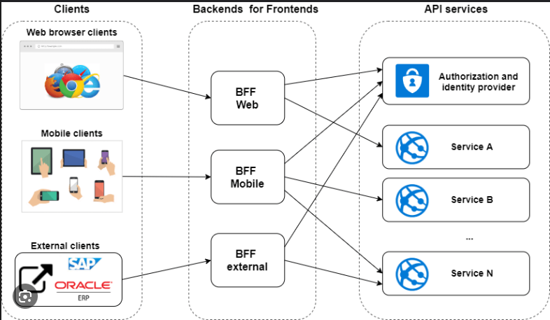

# Strangler Fig Pattern:
### Definition:
The Strangler Fig Pattern is a software design pattern used to incrementally migrate a legacy system to a new architecture by gradually replacing specific pieces of functionality with new applications and services. 
This pattern is particularly useful for modernizing large monolithic applications without causing significant downtime or disruption.  

### Steps Involved
1. Identify Components: Analyze the monolithic application to identify components that can be incrementally replaced.
2. Create Microservices: Develop new microservices to replace the identified components.
3. Implement a Façade: Use a façade to intercept requests to the legacy system and route them to either the old or new components.
4. Incremental Replacement: Gradually replace the old components with new microservices, ensuring that the system continues to function seamlessly.
5. Decommission Legacy Components: Once all components are replaced, decommission the legacy system.

### Benefits
1. Reduced Risk: Incremental changes minimize the risk of system failure.
2. Continuous Delivery: New features can be delivered continuously without waiting for a complete rewrite.
3. Improved Scalability: Microservices can be scaled independently.

### Challenges
1. Complexity: Managing two systems (legacy and new) simultaneously can be complex.
2. Façade Management: The façade must be carefully managed to avoid becoming a bottleneck or single point of failure.

# API Gateway Pattern:
### Definition:
The API Gateway pattern is a design pattern used in microservices architecture to provide a single entry point for clients to interact with multiple microservices. 
It acts as an intermediary that handles requests from clients, routes them to the appropriate microservices, and aggregates responses if necessary. 
This pattern helps to decouple clients from the microservices, providing a more manageable and secure way to handle communication.  

### Key Features of API Gateway
1. Reverse Proxy or Gateway Routing: The API Gateway acts as a reverse proxy, routing client requests to the appropriate microservices based on the request path, headers, or other criteria. This helps to decouple the client from the microservices and provides a single endpoint for the client to interact with.
2. Request Aggregation: The API Gateway can aggregate multiple client requests into a single request to reduce the number of round-trips between the client and the backend services. This is particularly useful for mobile or remote clients where latency is a concern.
3. Authentication and Authorization: The API Gateway can enforce security measures such as authentication and authorization, ensuring that only authenticated and authorized clients can access the microservices.
4. Load Balancing: The API Gateway can distribute incoming traffic across multiple instances of a microservice to ensure high availability and reliability.
5. Request Transformation: The API Gateway can modify request and response payloads to ensure compatibility between clients and services, making it easier to adapt to different client needs.
6. Caching: The API Gateway can cache responses to reduce the load on backend services and improve response times.
7. Logging and Monitoring: The API Gateway can centralize logging and monitoring, making it easier to track requests, errors, and performance metrics across all microservices.

### Benefits
1. Simplified Client Communication: Clients interact with a single endpoint rather than multiple microservices, simplifying the communication process.
2. Improved Security: Centralized authentication and authorization mechanisms enhance security.
3. Reduced Latency: Request aggregation reduces the number of round-trips between clients and backend services.
4. Scalability: Load balancing ensures that the system can handle increased traffic.

### Challenges
1. Single Point of Failure: The API Gateway can become a single point of failure if not properly managed.
2. Complexity: Implementing and maintaining an API Gateway can add complexity to the system.
3. Performance Bottleneck: The API Gateway can become a performance bottleneck if it is not properly scaled.

# Backend For Frontend (BFF):
### Definition:
The Backend For Frontend (BFF) pattern is an architectural approach in web application development that involves creating separate backend services tailored 
to the needs of different frontend clients. This pattern is particularly useful in scenarios where multiple user interfaces (UIs) such as mobile apps, web apps, 
and desktop applications require different data formats and interactions.  

The BFF pattern involves creating a unique backend for each user-facing frontend. These backends act as intermediaries, fetching data from various services 
and shaping it to fit the exact needs of the frontend. This approach ensures that each frontend receives precisely the data it needs, optimizing performance 
and user experience.  

### Key Concepts
1. Separation of Concerns: Each BFF is responsible for a specific frontend, allowing frontend and backend teams to work independently.
2. Tailored Data: The BFF fetches data from generic APIs and customizes it for the specific frontend, reducing unnecessary data transfer.
3. Improved Performance: By minimizing the logic on the frontend and handling data formatting in the BFF, the overall performance is enhanced.

### Benefits of the BFF Pattern
1. Optimized Data Transfer: Each frontend gets only the data it needs, reducing bandwidth usage and improving load times.
2. Simplified Frontend Logic: The frontend can focus on rendering data without worrying about data manipulation.
3. Scalability: Different BFFs can be scaled independently based on the load and requirements of their respective frontends.
4. Maintainability: Changes in one frontend do not affect others, making the system easier to maintain and evolve.

# Service Discovery Pattern:
The Service Discovery pattern is a crucial design pattern in microservices architecture, enabling services to locate each other dynamically within a network. 
This pattern addresses the challenge of finding the network locations of services, which can change frequently due to scaling, failures, or updates. 
Here’s an in-depth explanation of the Service Discovery pattern, including its types and examples.  

### Service Discovery involves three main components:
1. Service Registry: A centralized server that maintains a global view of all microservices' network locations (IP addresses and ports).
2. Service Providers: Microservices that register their network locations with the service registry.
3. Service Consumers: Clients or other microservices that query the service registry to find the network locations of service providers.

### How Service Discovery Works
1. Registration: Service providers register their network locations with the service registry at regular intervals.
2. Lookup: Service consumers query the service registry to find the network locations of the required services.
3. Invocation: Service consumers use the retrieved network locations to directly call the service providers.

### Types of Service Discovery Patterns
There are two primary types of service discovery patterns: Client-Side Discovery and Server-Side Discovery.

#### Client-Side Discovery Pattern
In the Client-Side Discovery pattern, the client is responsible for discovering the network locations of service instances and balancing the load among them.
##### How It Works
1. The client queries the service registry to get the list of available service instances.
2. The client selects an appropriate service instance using a load balancing algorithm.
3. The client makes a request to the selected service instance.

##### Advantages
1. Enables the client to make intelligent decisions based on specific requirements.
2. Facilitates application-specific load balancing decisions.
3. Simpler architecture without the need for an external load balancer.

##### Disadvantages
1. Tightly couples the client with the service registry.
2. Requires implementing service discovery logic for each programming language and framework used by the clients.
3. Increases complexity in managing disparate tools, technologies, and languages.

#### Server-Side Discovery Pattern
In the Server-Side Discovery pattern, the client does not interact directly with the service registry. Instead, a load balancer or router handles the discovery process.

##### How It Works
1. The client sends a request to a load balancer or router.
2. The load balancer queries the service registry to find an available service instance.
3. The load balancer routes the request to the selected service instance.

##### Advantages
1. Decouples the client from the service registry.
2. Simplifies client implementation as the discovery logic is handled by the load balancer.
3. Supports multiple programming languages and frameworks without additional discovery logic.

##### Disadvantages
1. Requires a highly available load balancer.
2. Adds an extra network hop, potentially increasing latency.
3. Requires managing and configuring the load balancer.

# Circuit Breaker Pattern
The Circuit Breaker pattern is a design pattern used in microservices architecture to prevent cascading failures and enhance system resilience. 
It acts as a safeguard, ensuring that a failure in one service does not lead to a total system breakdown.  

In a microservices architecture, services often need to communicate with each other. If one service fails or experiences high latency, 
it can cause the calling service to wait indefinitely, consuming precious resources such as threads. This can lead to resource exhaustion 
and potentially cause a cascading failure across the system.  

#### The Circuit Breaker pattern operates in three distinct states:
1. **Closed State**: In this state, the circuit breaker allows all requests to pass through to the service. It monitors the number of failures and, if the failures exceed a threshold, it transitions to the open state.
2. **Open State**: In the open state, the circuit breaker immediately fails all requests without attempting to call the service. This prevents the system from making calls to a service that is likely to fail, allowing the service time to recover.
3. **Half-Open State**: After a timeout period, the circuit breaker transitions to the half-open state. In this state, it allows a limited number of test requests to pass through. If these requests succeed, the circuit breaker transitions back to the closed state. If they fail, it returns to the open state.

The Circuit Breaker pattern is typically implemented at the code level. This pattern involves writing code that monitors the interactions between services, 
detects failures, and manages the state of the circuit breaker (Closed, Open, and Half-Open). Example: We can use a python decorator on an API to enable Circuit-breaker.  

### Benefits
1. Failure Isolation: Prevents a single service failure from cascading to other services.
2. Resource Protection: Protects system resources by failing fast and avoiding long waits for unresponsive services.
3. Resilience: Enhances the overall resilience and stability of the system.

### Challenges
1. Timeout Configuration: Choosing appropriate timeout values can be challenging. Incorrect values can lead to false positives or excessive latency.
2. Complexity: Implementing and managing circuit breakers adds complexity to the system.

### Real-World Implementations
1. Netflix Hystrix: A popular library that implements the Circuit Breaker pattern. It provides annotations and configuration options to easily integrate circuit breakers into microservices

